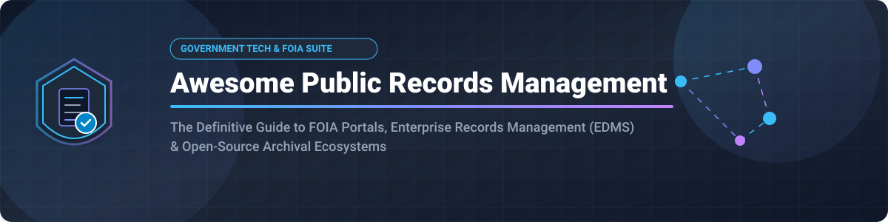

# 📂 Awesome Public Records Management Software & Ecosystem 🏛️

  
  
  
  
  

## 🌐 Comprehensive Public Records Management Platforms & Software Ecosystem 📄

**A Curated Ecosystem of Commercial SaaS Solutions & Open-Source GitHub Projects 🚀**

*Dedicated to FOIA/Freedom of Information Act Requests 📜, Public Records Tracking 🔍, Retention Schedules ⏰, Enterprise Document Management (EDMS) 🏢, and Municipal Transparency Portals 🏛️.*

**Last updated: September 2026** 📅

---

This repository serves as an authoritative index of **SaaS products** ☁️ and **open-source software** 💻 designed for **Public Records Management**. Government agencies, municipal IT departments, FOIA coordinators, and records officers utilize these platforms to streamline request intake, automated redaction ✏️, workflow tracking 📊, retention schedule enforcement ⏳, and public portal publishing 🌐.

---

## 📋 Table of Contents

- [📊 Market Size & Industry Landscape](#-market-size--industry-landscape)
- [☁️ SaaS & Hosted Commercial Platforms](#%EF%B8%8F-saas--hosted-commercial-platforms)
- [💻 Open-Source GitHub Projects](#-open-source-github-projects)
- [⭐ Key Features to Evaluate](#-key-features-to-evaluate)
- [📈 Star History](#-star-history)
- [🤝 How to Contribute](#-how-to-contribute)
- [⚠️ Disclaimer](#%EF%B8%8F-disclaimer)

---

## 📊 Market Size & Industry Landscape

The global **Government Records Management and FOIA Request Software Market** is estimated at approximately **$12.5 Billion to $15.0 Billion** 💰 (expanding across broader Enterprise Content Management & GovTech sectors), with steady growth driven by digital government mandates and transparency legislation ⚖️. The sector is **moderately fragmented**—featuring large enterprise content management conglomerates (such as OpenText and Hyland) alongside specialized GovTech platforms (such as Granicus GovQA and CivicPlus NextRequest) that lead specialized municipal FOIA request workflows.

---

## ☁️ SaaS & Hosted Commercial Platforms

Below is a curated comparison of leading SaaS public records management software and enterprise document management systems. The table includes company size (revenue / valuation), starting pricing tiers, and free trial limits, sorted by company size (descending).

| Product / Platform | Company Size (Revenue / Valuation) 📈 | Pricing 💳 | Free Tier Limits 🎁 | Description 📝 |
| :--- | :--- | :--- | :--- | :--- |
| **[OpenText Content Suite](https://www.opentext.com/)** | ~$5.17B Annual Revenue / ~$12.9B Market Cap | Custom quote-based (Enterprise subscription / per-user licensing) | No free trial available (Live demo upon request) | Enterprise information management platform used for large-scale government records governance and compliance. |
| **[Granicus (GovQA)](https://granicus.com/solution/govqa/)** | ~$325M Revenue / ~$4.0B Valuation | Starts at approx. $2,000–$4,300/year (custom quote-based on agency size) | No free trial available (Live demo upon request) | Market-leading FOIA and public records request management portal tailored for state, county, and city governments. |
| **[Hyland OnBase](https://www.hyland.com/)** | ~$850M Annual Revenue (Private Equity) | Starts at approx. $45–$54/user/month (enterprise licensing) | No free trial available (Live demo upon request) | Enterprise content services and case management platform widely deployed across government document workflows. |
| **[CivicPlus (NextRequest & Records)](https://www.civicplus.com/)** | ~$78M Revenue / ~$2.5B Valuation | Starts at approx. $7,300–$13,300/year (custom quote-based) | No free trial available (Live demo upon request) | All-in-one government technology suite featuring NextRequest portal for public records lifecycle management. |
| **[DocuWare](https://www.docuware.com/)** | ~$89M Revenue (Acquired by Ricoh) | Starts at approx. $75–$120/user/month (cloud subscription) | 30-day free trial (Full cloud capabilities, no credit card required) | Document management and workflow automation platform powering secure records capture, storage, and fulfillment. |
| **[Laserfiche](https://www.laserfiche.com/)** | ~$76M Annual Revenue | Cloud Starter starts at $45–$55/user/month | No free trial available (Live demo upon request) | Enterprise content management (ECM) and business process automation platform with robust records retention tools. |
| **[M-Files](https://www.m-files.com/)** | ~$100M ARR ("Centaur" Status) | Essentials tier starts at $65/user/month | 30-day free trial (Full collaboration capabilities, no credit card required) | Metadata-driven document and records management platform supporting automated compliance and information governance. |
| **[JustFOIA](https://www.justfoia.com/)** | ~$10M–$15M Estimated Revenue | Starts at approx. $2,000–$9,000/year (custom quote-based) | No free trial available (Live demo upon request) | Dedicated public records request software engineered to simplify intake, tracking, redaction, and reporting for agencies. |
| **[OpenCities Records](https://www.opencities.com/)** | ~$10M Estimated Revenue | Custom quote-based (approx. $500/month municipal packages) | No free trial available (Live demo upon request) | Digital government website and civic portal platform integrating public records requests and transparency features. |

---

## 💻 Open-Source GitHub Projects

Open-source document management systems (EDMS), document archiving software, and PDF processing utilities offer self-hosted alternatives for government agencies and tech-forward organizations. The table below is sorted by GitHub star count (descending) and features direct stargazer badge links.

| Project / Repository | Star_Count ⭐ | License 📜 | Primary Tech Stack 🛠️ | Description 📝 |
| :--- | :--- | :--- | :--- | :--- |
| **[Stirling-PDF](https://github.com/Stirling-Tools/Stirling-PDF)** |  | MIT | Java / Spring Boot / Docker | Robust locally hosted web application for PDF manipulation, page extraction, splitting, merging, and redacting public records. |
| **[Paperless-ngx](https://github.com/paperless-ngx/paperless-ngx)** |  | GPL-3.0 | Python / Django / Angular | Community-driven document management system focused on automated OCR, full-text indexing, metadata tagging, and digital archiving. |
| **[Nextcloud Server](https://github.com/nextcloud/server)** |  | AGPL-3.0 | PHP / JavaScript | Self-hosted productivity platform providing secure file storage, access control, audit logging, and document collaboration for agencies. |
| **[Docspell](https://github.com/eikek/docspell)** |  | AGPL-3.0 | Scala / Elm | Personal and small-organization document analysis and archival system featuring automatic item classification and search. |
| **[Mayan EDMS](https://gitlab.com/mayan-edms/mayan-edms)** |  | Apache-2.0 | Python / Django | Enterprise-grade open-source document management system with advanced retention policies, role-based security, workflow engine, and audit trails. |
| **[Nuxeo Platform](https://github.com/nuxeo/nuxeo)** |  | Apache-2.0 | Java | Extensible open-core content services platform designed for high-performance records management and custom governance applications. |
| **[Alfresco Community Repo](https://github.com/Alfresco/alfresco-community-repo)** |  | LGPL-3.0 | Java | Open-source enterprise content management repository providing document management, retention integration, and REST APIs. |

### 🏗️ Architectural Deployment Patterns for Open-Source Systems

For agencies seeking to implement self-hosted or open-source solutions:
1. **Core Repository**: Deploy **Mayan EDMS** or **Alfresco Community** as the foundational records repository with immutable audit logs and retention schedules.
2. **Document Processing & Redaction**: Utilize **Stirling-PDF** or **Paperless-ngx** for automated OCR, text extraction, and preparing public-facing redacted documents.
3. **Public Gateway**: Combine open-source document backends with custom FOIA intake forms or low-code request tracking portals.

---

## ⭐ Key Features to Evaluate

When selecting or architecting a public records management platform, government teams should prioritize:

- **FOIA Intake & Tracking** 📩: Automated request assignment, deadline calculations (business vs. calendar days), fee estimations, and status updates.
- **Redaction Capabilities** ✏️: Native, permanent PDF redaction tools for PII, SSNs, law enforcement exemptions, and sensitive metadata.
- **Records Retention Schedules** ⏰: Automated disposition schedules, legal hold enforcement, and archival policy compliance.
- **Public Transparency Portals** 🌐: Citizen-facing search portals for browsing previously released public documents and FOIA request logs.
- **Security & Compliance** 🔒: CJIS compliance, SOC 2 certification, role-based access control (RBAC), and detailed audit logs.

---

## 📈 Star History

---

## 🤝 How to Contribute

Contributions are welcome! To contribute to this curated ecosystem guide:

1. Fork this repository 🍴.
2. Add or update entries in `README.md` following the tabular format 📝.
3. Ensure entries include verifiable metrics (pricing tiers, company size, official documentation links, or GitHub star counts) 🔍.
4. Submit a Pull Request with a concise summary of changes 🚀.

---

## ⚠️ Disclaimer

- This list is **community-curated** for educational and research purposes—it does not constitute an endorsement.
- Public records management software handles legally regulated government data ⚖️. Organizations must evaluate solutions against applicable local, state, and federal laws (such as FOIA, state sunshine laws, and data privacy regulations). This repository does not provide legal or compliance counsel.

---

**Maintained for government records officers, FOIA coordinators, municipal IT leaders, and civic technology teams.** 🏛️
